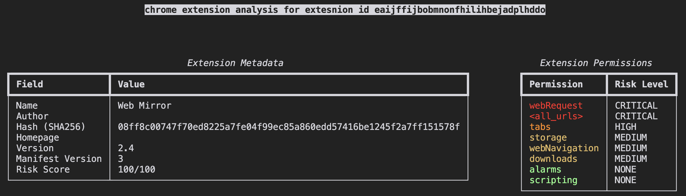

# crx-analyzer
[](https://badge.fury.io/py/crx-analyzer)




> [!IMPORTANT]
> crx-analyzer is still in development, breaking changes may occur. Please be aware of this when using the tool.


crx-analyzer is a Python tool for analyzing browser extensions through a risk management lens. It is designed to help you understand the risks associated with a browser extension and enable you to make informed decisions about whether to use it. In addition, it can also be used to aid analysts in hunting for potentially malicious extensions.

crx-analyzer was inspired by the [crxcavator](https://crxcavator.io/docs.html#/) tool and uses some of the same risk scoring techniques, but is focused on providing a local, open source implementation that won't have the risk of being taken down/no longer hosted.

The tool works by downloading the zipped extension file (crx) from the respective browser's extension store and then extracting the files to a temporary directory. It parses the manifest.json file to get the extension's permissions and then uses basic pattern matching to extract URLs that are referenced in the extension's code.

crx-analyzer can be used by an analyst and supports a "pretty" output mode to accommodate this. crx-analyzer also supports a "json" output mode that allows for flexible usage in other tools or even in a CI/CD pipeline.

# Installation

crx-analyzer is available on pypi, and GitHub container registry.

PyPI
```bash
pip install crx-analyzer
```
GitHub Container Registry
```bash
docker pull ghcr.io/rileydakota/crx-analyzer:latest
```

# Features

## Retrieval of Extensions from Browser Stores via ID

Crx-analyzer directly retrieves extensions from the browser stroes. This eliminates the need to manually download the extension, or copy it from another machine in the case of a security investigation. Supported browsers are:

- [x] Chrome
- [x] Edge
- [ ] Firefox (planned)
- [ ] Safari (planned)
- [ ] Brave (planned)

## Metadata extraction and analysis of Permissions in Manifest.json

Crx-analyzer extracts important metadata from the manifest.json file, including: name, version, homepage, and author. It also calculates a SHA256 hash of the CRX file prior to decompressing it.

The extensions permissions are also extracted and analyzed. Crx-analyzer supports all known permissions fields (`permissions`, `host_permissions`, `optional_permissions` and `optional_host_permissions`). Permissions are categorized the same, regardless of being optional or required.

## Risk score

Crx-analyzer provides a risk score based on the permissions and other metadata extracted from the extensions. The current weights can be viewed in the [risk.py](./crx_analyzer/risk.py#L90) file. Heavy inspiration was taken from the [crxcavator](https://crxcavator.io/docs.html#/) tool. The score has a maximum value of 100.

Currently, the risk score only uses extension permissions, but in the future it will also use other metadata such as the extension's name, version, author, and information pulled from the browser web store. Risk score in its current state should not be taken as absolute, but rather a potiential indicator. There will always be context outside the tool that will need to be considered.


## URL extraction

Crx-analyzer can extract URLs from the extensions code. This is done by using RegEx to find strings that match the pattern of a URL. Due to the nature of strings in JavaScript code, the URLs may contain additional characters that are not part of the URL itself. Currently, crx-analyzer does not attempt to clean these URLs, but this may be added in the future.

URLs will be matched regardless if they are in executable code or comments. Ultimately this feature is meant to be used as a starting point for further analysis, and not as a definitive source of URLs.


# Usage

Get current version

```bash
crx-analyzer version
```

Analyze an extension from the Chrome Web Store

```bash
crx-analyzer analyze --id eaijffijbobmnonfhilihbejadplhddo --browser chrome --output pretty
```

Analyze an extension from the Edge Add-ons Store

```bash
crx-analyzer analyze --id eaijffijbobmnonfhilihbejadplhddo --browser edge --output pretty
```

Output extension results to json format

```bash
crx-analyzer analyze --id eaijffijbobmnonfhilihbejadplhddo --browser chrome --output json
```

# Development

## Setup

1. Install uv using one of these methods:

```bash
brew install uv
```

2. setup pre-commit hooks

```bash
uv run pre-commit install
```

## Developement tasks

### Run tests
```bash
uv run pytest
```

### Linters and styling

```bash
uv run pre-commit
```
